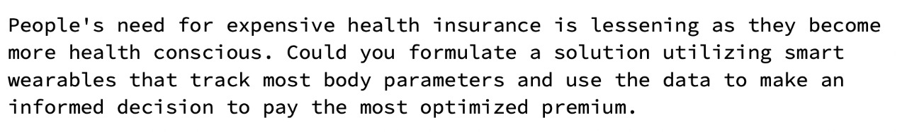
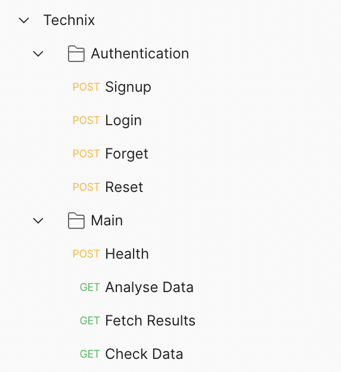
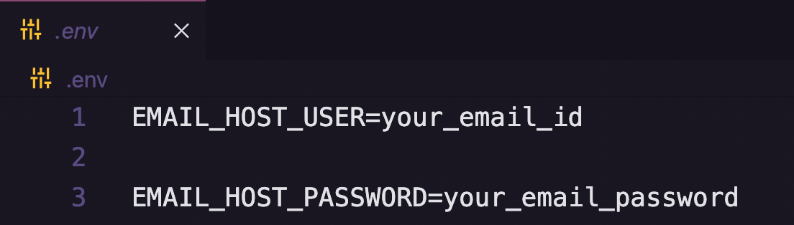

## Insurance Recommendation System

The basic aim for implementing **Insurance Recommendation System** is to suggest best insurance to the users based on thier health.
Every user is given a health score based on his/her vitals; of which data is measured by the the wearables data.
Wearables data such as Cardiopulmonary and Vascular data and Glucose level.
So basically *suggesting the best insurance policy based on their wearables data*.


### 🔗 Content

- [Overview](#insurance-recommendation-system)
- [Content](#-content)
- [Event Overview](#-event-overview)
- [Team](#-team)
- [Problem Statement](#-problem-statement)
- [Features](#-features)
- [Tech Stack](#-tech-stack)
- [API Reference](#-api-reference)
- [Environment Variables](#-environment-variables)
- [Run Locally](#-run-locally)
- [Documentation](#-documentation)
- [Author](#-author)


### 🧬 Event Overview

Me and my team participated at a Hackathon event at [Technix](https://www.linkedin.com/feed/hashtag/?keywords=inspirus2k21) in October 2021 at [Goa College of Engineering, Goa](https://www.linkedin.com/school/gecgoa/). 
Me along with [Vivek Silimkhan](https://www.linkedin.com/in/vivek-silimkhan/) and [Azvern Dias](https://www.linkedin.com/in/azverndias0912/) had participated as a team, where I was working on [Django application](https://github.com/atharvparkhe/Technix-Technotohon-2k22-Insurance-Recommendation-System) (Backend), *Azvern* was handling [Flutter application](https://github.com/azverndias09/HackathonFrontEnd2022) (Frontend) and *Vivek* was developing ML models [ML Models](https://github.com/spacegroot/HealthWear) (ML Models).


### 👨‍👦‍👦 Team

- `Atharva Parkhe` -  Django Developer (Backend)  -  *Python* - [LinkedIn](https://www.linkedin.com/in/atharva-parkhe-3283b2202/), [GitHub](https://github.com/atharvparkhe)

- `Vivek Silimkhan` -  *Python* - ML Developer (ML) - [LinkedIn](https://www.linkedin.com/in/vivek-silimkhan/), [GitHub](https://github.com/spacegroot)

- `Azvern Dias` -  *Dart* -  Flutter Developer (Frontend) - [LinkedIn](https://www.linkedin.com/in/azverndias0912/), [GitHub](https://github.com/azverndias09) 


### 📃 Problem Statement




### 📋 Features

- **USER AUTHENTICATION :** Users can Signup for a new account, Verify thier email id, Login using email and password, make a Forgot request to reset thier password. 

- **RESTAURANTS :** Users can view all restaurants listed on the app.

- **BOOKING :** User can make booking by selecting time-slots for a perticular service as per users choice.

- **SELLER AUTHENTICATION :** Seller (Shop-keepers) can Signup for a new account, Verify thier email id, Login using email and password, make a Forgot request to reset thier password. 

- **SELLER CMS :** Seller can manage thier content on the site. They can add, modify, delete thier online shop and the products that they sell in thier shop.

- **SELLER ORDER MANAGEMENT :** Seller can manage thier orders through the dashboard.


### 🧰 Tech Stack

- **`BACKEND`** : Django *(Python)*

- **`DATABASE`** : SQLite3

- **`FRONTEND`** : 
    - **Customer Application :** Flutter *(Dart)*


### 🛠 API Reference

**Postman Endpoints** : https://www.getpostman.com/collections/e72ddb4279b982ed4832



**API Endpoints JSON file** (for importing into thunderclient / postman) is available in the docs folder or click [here](docs/endpoints.json)


### 🔐 Environment Variables

To run this project, you will need to add the following environment variables to your **.env** file

- `EMAIL_ID`  -  Email ID (which would be used to send emails)

- `EMAIL_PW`  -  Email Password




### 💻 Run Locally

***Step#1 : Clone Project Repository***

```bash
git clone https://github.com/atharvparkhe/Technix-Technotohon-2k22-Insurance-Recommendation-System.git && cd Technix-Technotohon-2k22-Insurance-Recommendation-System
```

***Step#2 : Create Virtual Environment***

- If *virtualenv* is not istalled :
```bash
pip install virtualenv && virtualenv env
```
- **In Windows :**
```bash
    env/Scripts/activate
```
- **In Linux or MacOS :**
```bash
    source env/bin/activate
```

***Step#3 : Install Dependencies***

```bash
pip install --upgrade pip -r requirements.txt
```

***Step#4 : Add .env file***

- ENV file contents
    - **In Windows :**
    ```bash
        copy .env.example .env
    ```
    - **In Linux or MacOS :**
    ```bash
        cp .env.example .env
    ```
- Enter Your Credentials in the *".env"* file. Refer [Environment Variables](#-environment-variables)

***Step#5 : Run Server***

```bash
python manage.py runserver
```

- Open `http://127.0.0.1:8000/` or `http://localhost:8000/` on your browser.

*Check the terminal if any error.*


### 📄 Documentation

The docs folder contain all the project documentations and screenshots of the project.You can go through the presentation [here](presentaion.pptx)

- **Local Server Base Link :** http://localhost:8000/

- **Complete Code Link :** https://github.com/Technix-Technothon2k22/Team-Delta

- **Admin Pannel Access :**
    - ***Email :*** "admin@admin.com"
    - ***Password :*** "password"

- **Frontend Section :**
    - **Code :** https://github.com/azverndias09/HackathonFrontEnd2022
    - **Author :** ***Azvern Dias*** - [GitHub](https://github.com/azverndias09), [LinkedIn](https://www.linkedin.com/in/azverndias0912/)

- **ML Models :**
    - **Code :** https://github.com/spacegroot/HealthWear
    - **Author :** ***Vivel Silimkhan*** - [GitHub](https://github.com/spacegroot), [LinkedIn](https://www.linkedin.com/in/vivek-silimkhan/)


### 🙋🏻‍♂️ Author

**🤝 Connect with Atharva Parkhe**

[](https://www.linkedin.com/in/atharva-parkhe-3283b2202/)
[](https://www.github.com/atharvparkhe/)
[](https://www.twitter.com/atharvparkhe/)
[](https://www.instagram.com/atharvparkhe/)
[](https://leetcode.com/patharv777/)
[](https://www.youtube.com/channel/UChimOJO64hOqtE7HCgtiIig)
[](https://discord.gg/8WNC43Xsfc)
